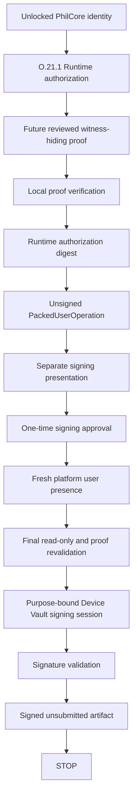

# O.21.2 Device Vault Bound Ethereum Sepolia Signing

## Status

O.21.2 signing code is retained, but normal signed-artifact creation is
cryptographically quarantined. The current STWO artifact is secret-bearing, so
default preparation stops before this boundary. Downstream lifecycle tests use
an explicitly hypothetical witness-hiding proof stack and do not establish a
production proof implementation.

After a future reviewed witness-hiding proof is integrated, the desktop design can consume one same-process O.21.1 preparation, obtain a separate
signing approval and fresh user presence, revalidate the proof and operation,
request one purpose-bound Device Vault signature, validate it, and write a
signed-but-unsubmitted artifact.

No account deployment, funding, bundler contact, UserOperation submission, ETH
movement, or public mutation is implemented by this boundary.

## Flow



## Exact Bindings

The signature boundary binds:

* Ethereum Sepolia chain ID `11155111`;
* canonical ERC-4337 v0.7 EntryPoint;
* smart account, sender, target, zero value, calldata, nonce, gas, and fees;
* authorization expiry and Runtime authorization digest;
* proof input hash and proof artifact digest;
* identity, owner commitment, session, and vault handle;
* validator address, key reference, and validator key ID;
* the separate signing-presentation digest and fresh-presence digest;
* purpose `ethereum_sepolia_local_proof_gated_v1_signing`.

Any changed signed field changes the canonical UserOperation hash or fails an
explicit equality check. The one-time Device Vault session accepts only the
bound account-signature digest and invalidates after use.

## Device Vault Boundary

The secp256k1 execution-validator key is generated independently from
`phil_secret`, `identityRoot`, and `ownerCommitment`. It is encrypted in the
desktop Device Vault record. While unlocked, protected validator material is
available only in the desktop main process.

The retained O.21.2 adapter uses the N.3 one-time signing-session boundary. Its protected
callback receives only the exact purpose-bound digest. It does not return a
private key and cannot sign an arbitrary transaction, message, target, chain,
or UserOperation.

The renderer and preload receive:

* an immutable, sanitized signing presentation;
* approval and fresh-authentication workflow controls;
* a sanitized signed-artifact result.

They do not receive a signer, private key, proof bytes, witness, arbitrary
digest-signing method, mutation RPC, bundler transport, or submission method.

## Approval Copy

The normal user view states:

> You are approving a local Ethereum action.
>
> **Action:** Create Ethereum test account
>
> **Network:** Ethereum Sepolia
>
> **Security:** Verified locally by PhilCore
>
> **What happens:** Your device will authorize this action.
>
> Nothing has been sent to Ethereum.

The signing approval is separate from the O.21.1 preparation approval. It is
one-time, expires, and is bound to the exact presentation digest. Fresh
platform presence is obtained after local proof verification and after the
final UserOperation exists.

## Revalidation

In the retained future-path lifecycle, immediately before signing, Runtime:

1. confirms the identity, session, vault handle, and validator are unchanged;
2. revalidates the O.21.1 artifact and all Runtime digest correlations;
3. reruns local verification against the retained process-local proof artifact;
4. repeats the restricted Sepolia read-only preflight;
5. confirms EntryPoint code, chain, empty proposed addresses, nonce policy, and
   fee ceiling;
6. validates the current signing approval and fresh-presence evidence;
7. recomputes the canonical UserOperation and account-signature digests;
8. creates one exact N.3 signing session.

Lock, restart, session change, identity change, approval replay, presence loss,
proof capability loss, expiry, or any binding mutation fails closed.

## Artifact

The file schema is
`philcore-local-proof-gated-signed-user-operation-v1`. Desktop artifacts are
written mode `0600` under:

```text
<identity storage>/ethereum-sepolia/signed-user-operations/
```

The artifact contains the unsigned and signed PackedUserOperation, signature,
canonical hash, authorization digest, public validator binding, chain,
security model, and safe proof references. It explicitly records:

* `ethereumVerifiedProof: false`;
* `starkVerificationLocation: "local"`;
* `publicMutationOccurred: false`;
* `userOperationSubmitted: false`;
* `transactionSubmitted: false`;
* `ethMoved: false`;
* `contractsDeployed: false`.

It contains no private key, `phil_secret`, witness, proof bytes, vault key,
wrapping key, recovery key, seed, or raw signing secret.

## Stop Point

```text
validated Device Vault signature
  -> signed-but-unsubmitted artifact
  -> sanitized audit evidence
  -> STOP
```

There is no renderer submission control, bundler method, mutation RPC, account
deployment, funding action, paymaster, or public-network approval in O.21.2.

## O.21.3 Transition

The signed artifact is intentionally insufficient as standalone submission
authority. A future submission boundary must reload and cryptographically
verify its signature envelope, correlate the original unsigned and Runtime
evidence, recompute factory/CREATE2 and EntryPoint bindings from accepted
deployments, obtain fresh bundler gas and prefund evidence, and require a
separate exact submission approval.

See
[O.21.3 Final Ethereum Submission Boundary Review](./O21_3_FINAL_ETHEREUM_SUBMISSION_BOUNDARY_REVIEW.md).
