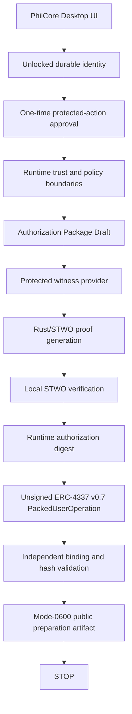

# O.21.1 Runtime Connected Local Proof Preparation

## Status

O.21.1 connects the unlocked PhilCore desktop Runtime to the proposed
`local-proof-gated-v1` Ethereum Sepolia preparation profile. It prepares one
unsigned ERC-4337 v0.7 `PackedUserOperation` and stops.

It does not deploy, fund, sign, submit, or mutate a public network.

## Flow



## Trust Boundaries

The renderer may request the fixed experimental workflow, display sanitized
stages, approve or reject the Runtime presentation, and inspect safe summaries.
It cannot choose proof inputs, target addresses, calldata, gas policy, account
bindings, RPC methods, signing keys, or submission transports.

The main-process Runtime is the only component that receives the unlocked
identity material. It passes `phil_secret` and the fresh nullifier seed directly
to the existing protected witness provider. The witness is consumed through the
prover's standard-input boundary. It is not written to a file, included in the
export, returned to the renderer, or added to Activity.

The Sepolia RPC boundary is read-only. It permits chain, code, balance, nonce,
fee, call, and gas-estimation reads. It exposes no deployment, signing,
transaction-send, or bundler-submission method.

## What The STARK Proves

The existing `stwo-unlock-keccak-v1` proof validates the ACTION_UNLOCK public
tuple for the Runtime-created Authorization Package:

* owner commitment;
* canonical action hash;
* policy hash;
* fresh public nullifier;
* consumer-data hash;
* expiry.

The Runtime verifies the proof locally and binds its digest, `proofInputHash`,
nullifier, one-time approval, identity, session, target, and expiry into a
domain-separated Runtime authorization digest.

## What Ethereum Does Not Verify

No Ethereum contract verifies the STARK proof in O.21.1. The proposed
`local-proof-gated-v1` account relies on PhilCore's local verification before a
future validator signature. The exported artifact therefore states:

```text
ethereumVerifiedProof: false
starkVerificationLocation: local
publicMutationOccurred: false
```

No signature is created in this phase. A future signature would bind the exact
Runtime authorization digest and recalculated UserOperation hash, but that
boundary is intentionally unavailable here.

## Artifact

Successful preparations are written below the desktop identity storage root:

```text
ethereum-sepolia/unsigned-user-operations/<artifactId>.json
```

On the standard desktop profile, the full location is:

```text
~/Library/Application Support/PhilCore Desktop Local Alpha/
  philcore-local-identities/
  ethereum-sepolia/
  unsigned-user-operations/
  <artifactId>.json
```

The file is created with mode `0600`. It contains public preparation evidence
and the unsigned operation. It omits proof bytes, witness material, secrets,
private keys, signatures, and submission authority.

## Validation And Stop Condition

Before export, the Runtime independently checks:

* the selected identity is unlocked and exactly matches the O.20 profile;
* owner commitment, validator address, key reference, and contract key binding;
* Ethereum Sepolia chain ID `11155111`;
* canonical ERC-4337 v0.7 EntryPoint;
* proposed factory, account, and fixed confirmation target;
* a fresh, non-reused proof and nullifier;
* proof generation and local verification correlation;
* one-time approval and Runtime authority correlation;
* zero value, disabled paymaster, empty signature;
* exact account calldata and confirmation-target calldata;
* recalculated UserOperation hash;
* unexpired approval and authorization.

The terminal UI message is:

> Prepared locally. Nothing has been sent to Ethereum.

## O.21.2 Transition

O.21.2 implements the separately guarded Device Vault signing boundary for the
same-process O.21.1 artifact. The O.21.1 file alone remains insufficient:
proof bytes are absent, its preparation approval is consumed, and it contains
no fresh signing-presence evidence.

Signing requires the retained process-local verified-proof capability, a
separate one-time presentation and approval, post-verification fresh
authentication, the explicit Ethereum Sepolia local-proof signing purpose, and
one-time N.3 Device Vault session revalidation.

Deployment, account funding, bundler submission, and public mutation remain
separate approvals and are not implied by an O.21.1 artifact.

See [O.21.2 Device Vault Bound Ethereum Sepolia Signing](./DEVICE_VAULT_SIGNING_BOUNDARY_REVIEW.md).
